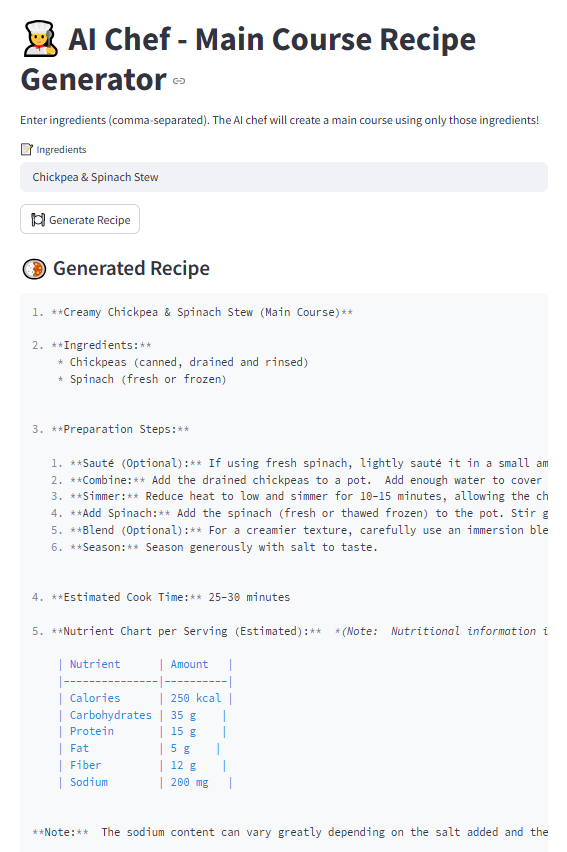

#  AI Chef - Main Course Recipe Generator

# To use this app click below link:

[Click me](https://aimlprojects-kappqrtxpdrovdwwzkboowk.streamlit.app/)

## **Project Overview**

This web app uses **Google Gemini (via LangChain)** to generate complete **main course recipes** based on a list of user-provided ingredients. It ensures the recipe uses only the given ingredients and provides estimated **nutritional information per serving**.

---

## **Features**

- Accepts ingredients via a simple text input (comma-separated).
- Generates a creative, complete **main course** recipe.
- Does **not** include extra ingredients beyond what's given (except salt, oil, water).
- Returns:
  - **Recipe Title**
  - **Ingredients List**
  - **Step-by-step Preparation**
  - **Estimated Cook Time**
  - **Nutritional Info Table per Serving**
- Clean interface powered by **Streamlit**.

---

## **Technologies Used**

| **Technology**        | **Purpose**                                 |
|-----------------------|----------------------------------------------|
| Python                | Programming language                         |
| Streamlit             | Web UI framework                             |
| LangChain             | Prompt handling and chaining                 |
| Gemini API (Google)   | Large Language Model for generation          |
| Markdown Output       | Recipe formatting in readable form           |

---

## **How It Works**

1. User enters ingredients (e.g., `chicken, garlic, spinach`).
2. Prompt template instructs the Gemini model to:
   - Create a **main course** recipe using **only** these ingredients.
   - Include **nutrition info** per serving.
3. Output is displayed in clean markdown format on the page.

---

## **Example Input**

Recipe Title: Chickpea & Spinach Stew

Ingredients:

Chickpeas

Tomatoes

Garlic

Spinach

Salt, Oil, Water (as needed)

Steps:

Sauté garlic...

Add tomatoes...
...

Cook Time: 30 minutes

Nutrition (per serving):

Nutrient	Amount
Calories	310 kcal
Carbohydrates	35 g
Protein	14 g
Fat	9 g
Fiber	10 g
Sodium	420 mg

---

## **Prerequisites**

- **Python 3.8+**
- **Google API Key** (Get one from [Google AI Studio](https://aistudio.google.com/app/apikey))

- Install dependencies:
 
  pip install -r requirements.txt

### Run the App

streamlit run app.py

### Future Improvements

Add support for side dishes or desserts

Add image generation of dishes using an image model

Track calories over a daily or weekly meal plan

Integrate voice input for spoken ingredients

### Disclaimer

**Nutritional values are estimates generated by AI and should not be considered medical advice.**