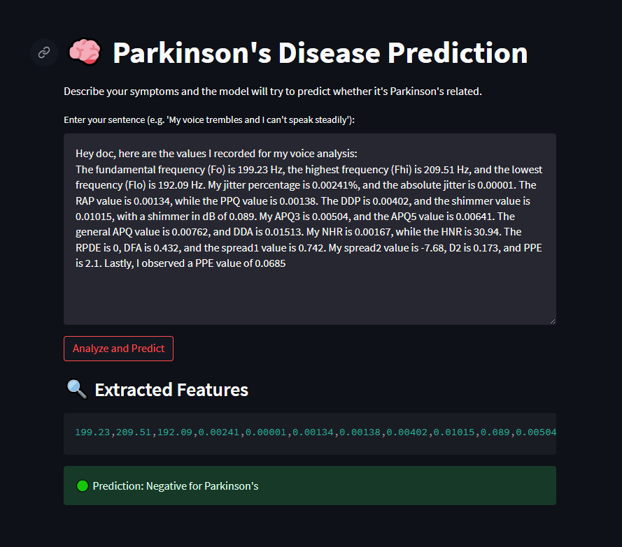

# Parkinson's Disease Prediction using Gemini + LangChain + ML:

# To use this app click below link:

This project predicts whether a patient has Parkinson’s disease based on voice measurements. Users can speak or write their symptoms or values in a natural, casual language, and the app uses AI to extract key features and predict the result using a pre-trained machine learning model.

### Features:

Accepts human-like sentences as input (e.g., "My Fo is around 180, shimmer is 0.03...")

Uses Gemini API (via LangChain) to extract 22 medical voice features from text.

Scales and feeds the features into a pre-trained SVC (Support Vector Classifier) model.

Returns prediction as "Positive" or "Negative" for Parkinson’s.

Clean, console-based feedback for extracted values and model prediction.

### Technologies Used

**Technology	- Purpose**
Python	- Programming language for implementation
LangChain -	To build a chain and extract data from input text
Gemini API -	LLM to understand and parse human-like sentences
scikit-learn -	For model training and scaling (SVC, StandardScaler)
NumPy -	Array and numerical processing
Pickle -	Load and save ML model and scaler

### How It Works

The user provides a natural language input (typed or spoken).

Gemini LLM processes the sentence and extracts the 22 required features.

Features are converted into a NumPy array and scaled using StandardScaler.

Pre-trained SVC model predicts if the person has Parkinson’s.

Output is displayed in a readable format.

### Example Input

**Hey doc, I recorded some values: Fo is like 180.9, Fhi close to 200.1, Flo at 155.4...**

###  Output

Extracted Values:
180.9, 200.1, ..., 0.2
Prediction: Positive for Parkinson's

### Prerequisites

Python 3.8+

Gemini API Key (Google Generative AI)

pip install -r requirements.txt

### Future Improvements

Add Streamlit or Flask web interface

Support for audio-to-text (voice input)

More model types for comparison