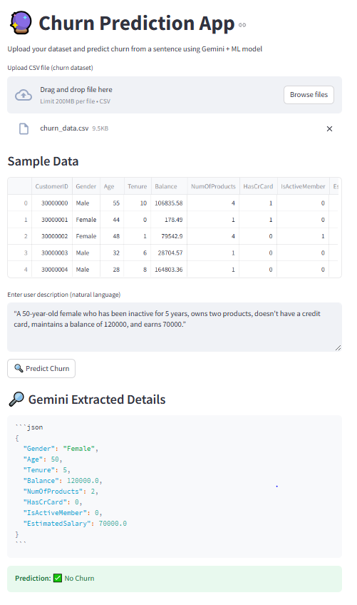

# Churn Prediction App using **Gemini + LangChain + Streamlit + ML**

# To use this app click below link:

[Click me](https://aimlprojects-zb7gschypfewwzv7ubi63e.streamlit.app/)




##  **App Overview**

This web application predicts whether a customer will churn based on natural language input (e.g., "A 35-year-old male with a balance of 50,000..."). The app uses **Google Gemini via LangChain** to extract structured features from plain sentences, which are then passed to a trained **Random Forest classifier** for prediction.

---

## **Features**

- Accepts natural language input like:  
  _"A 40-year-old female customer with 2 products, a balance of 60,000, active member..."_

- Extracts 8 structured features using **Gemini API**:
  - Gender
  - Age
  - Tenure
  - Balance
  - NumOfProducts
  - HasCrCard
  - IsActiveMember
  - EstimatedSalary

- Trains a **Random Forest** model on your uploaded dataset
- Predicts customer churn based on structured input
- Displays extracted data and prediction result

---

## **Technologies Used**

| **Technology**       | **Purpose**                                           |
|----------------------|--------------------------------------------------------|
| **Python**           | Programming language                                   |
| **Streamlit**        | Web app framework                                      |
| **LangChain**        | LLM chaining and template management                   |
| **Gemini API**       | LLM used to extract structured data from text         |
| **scikit-learn**     | Machine learning model (Random Forest Classifier)      |
| **pandas**           | Data handling and preprocessing                        |
| **joblib / json / re** | Model management, JSON parsing, and regex            |

---

## **How It Works**

1. User uploads a CSV dataset containing churn information.
2. The app preprocesses the data and trains a **Random Forest Classifier**.
3. User inputs a natural language sentence describing a customer's profile.
4. The **Gemini LLM** extracts 8 numerical and categorical features from the input.
5. These features are passed to the trained model.
6. The app displays the prediction: **Churn** or **No Churn**.

---

## **Example Input**

**"A 35-year-old male with 1 product, a balance of 45000, not active, with credit card, earns 70000."**

## **Example Output**

```json
{
  "Gender": "Male",
  "Age": 35,
  "Tenure": 5,
  "Balance": 45000,
  "NumOfProducts": 1,
  "HasCrCard": 1,
  "IsActiveMember": 0,
  "EstimatedSalary": 70000
}


Prerequisites

Python 3.8+

Gemini API Key from Google Generative AI

Install dependencies:


pip install -r requirements.txt

Run the App

streamlit run app.py

Future Improvements

Save and reuse trained model (avoid retraining on each run)

Add session state support for model persistence

Add support for voice input (speech-to-text)

Use preloaded datasets and allow manual editing of inputs